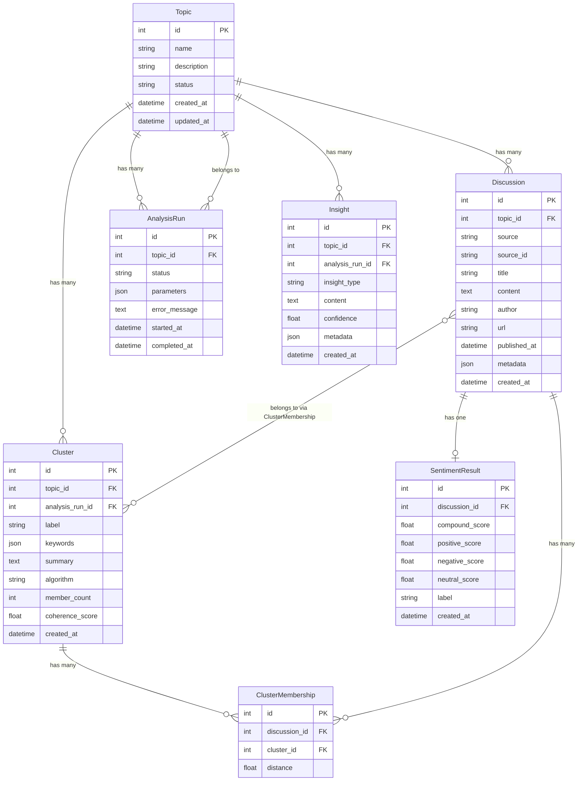

# TrendDNA — Entity-Relationship Diagram

## ER Diagram



---

## Table Descriptions

### Topic

The root entity. Everything else references a topic.

| Field | Type | Purpose |
|---|---|---|
| `id` | AutoField (PK) | Primary key |
| `name` | CharField(200) | User-provided topic query (e.g., "AI in education") |
| `description` | TextField (optional) | Auto-generated summary after analysis |
| `status` | CharField(20) | `pending` / `ingesting` / `analyzing` / `completed` / `failed` |
| `created_at` | DateTimeField | Auto-set on creation |
| `updated_at` | DateTimeField | Auto-updated on save |

**Why `status` field?**: The analysis pipeline takes time. The frontend polls this
field to show progress. Without it, the user sees a blank screen during processing.

**Interview Q**: "Why not use a boolean `is_complete`?"
**Answer**: "A boolean can't distinguish between `ingesting` and `analyzing`. The
status field gives the frontend enough information to show a meaningful progress
indicator — 'Collecting discussions from Reddit...' vs 'Clustering discussions...'"

---

### Discussion

Individual posts/comments collected from data sources.

| Field | Type | Purpose |
|---|---|---|
| `id` | AutoField (PK) | Primary key |
| `topic_id` | ForeignKey(Topic) | Which topic this belongs to |
| `source` | CharField(20) | `reddit` or `youtube` — which platform |
| `source_id` | CharField(200) | Platform-specific ID (Reddit post ID, YouTube comment ID) |
| `title` | CharField(500) | Post/video title |
| `content` | TextField | Cleaned text content |
| `author` | CharField(200) | Username (anonymized if needed) |
| `url` | URLField | Link back to original |
| `published_at` | DateTimeField | When originally posted (for timeline) |
| `metadata` | JSONField | Platform-specific extras (subreddit, video_id, upvotes, etc.) |
| `created_at` | DateTimeField | When we ingested it |

**Why `metadata` as JSON?**: Reddit has `subreddit`, `upvotes`, `num_comments`.
YouTube has `video_id`, `like_count`, `reply_count`. A JSON field avoids
platform-specific columns that would be NULL for other sources.

**Interview Q**: "Why not a separate table per platform?"
**Answer**: "That would complicate the pipeline — embeddings and clustering operate
on discussions regardless of source. A single table with a `source` discriminator
and a flexible `metadata` JSON field gives us uniformity for the pipeline while
preserving platform-specific data."

**Common Mistake**: Not including `source_id`. Without it, re-running ingestion
creates duplicates. The `source + source_id` pair acts as a natural unique constraint.

---

### AnalysisRun

Tracks each execution of the analysis pipeline.

| Field | Type | Purpose |
|---|---|---|
| `id` | AutoField (PK) | Primary key |
| `topic_id` | ForeignKey(Topic) | Which topic was analyzed |
| `status` | CharField(20) | `running` / `completed` / `failed` |
| `parameters` | JSONField | Algorithm config (e.g., `{"algorithm": "kmeans", "max_k": 10}`) |
| `error_message` | TextField (optional) | Error details if failed |
| `started_at` | DateTimeField | Pipeline start time |
| `completed_at` | DateTimeField (optional) | Pipeline end time |

**Why this table exists**: A topic can be re-analyzed with different parameters.
Without tracking runs, you can't compare results or debug failures.

**Interview Q**: "Is this an audit log?"
**Answer**: "Partially. It's primarily for operational visibility — if analysis fails
at the clustering step, I can see exactly when it failed and what parameters were
used. It also enables re-analysis: a user can trigger a new run without losing
previous results."

---

### SentimentResult

VADER sentiment scores per discussion.

| Field | Type | Purpose |
|---|---|---|
| `id` | AutoField (PK) | Primary key |
| `discussion_id` | OneToOneField(Discussion) | One sentiment per discussion |
| `compound_score` | FloatField | VADER compound score (-1.0 to 1.0) |
| `positive_score` | FloatField | Positive component (0 to 1) |
| `negative_score` | FloatField | Negative component (0 to 1) |
| `neutral_score` | FloatField | Neutral component (0 to 1) |
| `label` | CharField(10) | `positive` / `negative` / `neutral` |
| `created_at` | DateTimeField | When computed |

**Why separate table (not a column on Discussion)?**: Single Responsibility. The
Discussion table owns text data; SentimentResult owns analysis output. If we swap
VADER for a transformer model later, we only change the sentiment service and this
table — Discussion stays untouched.

**Why store all four scores?**: The `compound_score` is the primary metric for
timelines, but the component scores enable richer visualizations (stacked bar charts
showing positive/negative/neutral ratios per cluster).

---

### Cluster

Groups of semantically similar discussions.

| Field | Type | Purpose |
|---|---|---|
| `id` | AutoField (PK) | Primary key |
| `topic_id` | ForeignKey(Topic) | Which topic |
| `analysis_run_id` | ForeignKey(AnalysisRun) | Which run produced this |
| `label` | CharField(200) | Auto-generated label (top keywords) |
| `keywords` | JSONField | Top TF-IDF keywords for this cluster |
| `summary` | TextField | AI-generated cluster summary |
| `algorithm` | CharField(20) | `kmeans` or `dbscan` |
| `member_count` | IntegerField | Number of discussions in cluster |
| `coherence_score` | FloatField | Intra-cluster similarity (quality metric) |
| `created_at` | DateTimeField | When computed |

**Interview Q**: "How do you generate the cluster label?"
**Answer**: "After KMeans assigns discussions to clusters, I run TF-IDF on each
cluster's combined text to extract the top 3-5 keywords. Those keywords become the
label. For example, a cluster about GPU pricing might get labeled 'GPU prices shortage
NVIDIA supply'."

---

### ClusterMembership

Many-to-many relationship between discussions and clusters.

| Field | Type | Purpose |
|---|---|---|
| `id` | AutoField (PK) | Primary key |
| `discussion_id` | ForeignKey(Discussion) | Which discussion |
| `cluster_id` | ForeignKey(Cluster) | Which cluster |
| `distance` | FloatField | Distance from cluster centroid |

**Why not ManyToManyField?**: Django's built-in M2M doesn't store extra data.
The `distance` field lets us rank discussions within a cluster — those closest
to the centroid are the most representative. The explainability panel uses this
to show "most representative discussions" for each cluster.

---

### Insight

AI-generated explanations and detected patterns.

| Field | Type | Purpose |
|---|---|---|
| `id` | AutoField (PK) | Primary key |
| `topic_id` | ForeignKey(Topic) | Which topic |
| `analysis_run_id` | ForeignKey(AnalysisRun) | Which run produced this |
| `insight_type` | CharField(30) | `trend_spike` / `sentiment_shift` / `cluster_summary` / `explanation` |
| `content` | TextField | Human-readable insight text |
| `confidence` | FloatField | 0.0 to 1.0 confidence score |
| `metadata` | JSONField | Supporting data (spike timestamps, keyword lists, etc.) |
| `created_at` | DateTimeField | When generated |

**Interview Q**: "What's the difference between insight types?"
**Answer**:
- `trend_spike` — "Discussion volume about 'layoffs' increased 300% on March 15th"
- `sentiment_shift` — "Sentiment around 'remote work' shifted from positive to negative after Week 3"
- `cluster_summary` — "Cluster 2 is about 'salary negotiations' with 47 discussions"
- `explanation` — "You're seeing this spike because 3 viral Reddit posts drove discussion"

---

## Indexes (Performance)

```sql
-- Fast lookup of discussions by topic
CREATE INDEX idx_discussion_topic ON discussion(topic_id);

-- Timeline queries need published_at sorted
CREATE INDEX idx_discussion_published ON discussion(topic_id, published_at);

-- Prevent duplicate ingestion
CREATE UNIQUE INDEX idx_discussion_source ON discussion(source, source_id);

-- Fast sentiment aggregation by topic
CREATE INDEX idx_sentiment_discussion ON sentiment_result(discussion_id);

-- Cluster queries by topic and run
CREATE INDEX idx_cluster_topic ON cluster(topic_id, analysis_run_id);
```

**Interview Q**: "How did you decide which indexes to add?"
**Answer**: "I looked at the queries the API will run most frequently:
listing discussions by topic (needs topic_id index), rendering timelines
(needs published_at sorted), and preventing duplicates during re-ingestion
(needs the source+source_id unique index). I didn't add indexes on every
foreign key — only the ones actually used in WHERE clauses and JOINs."
